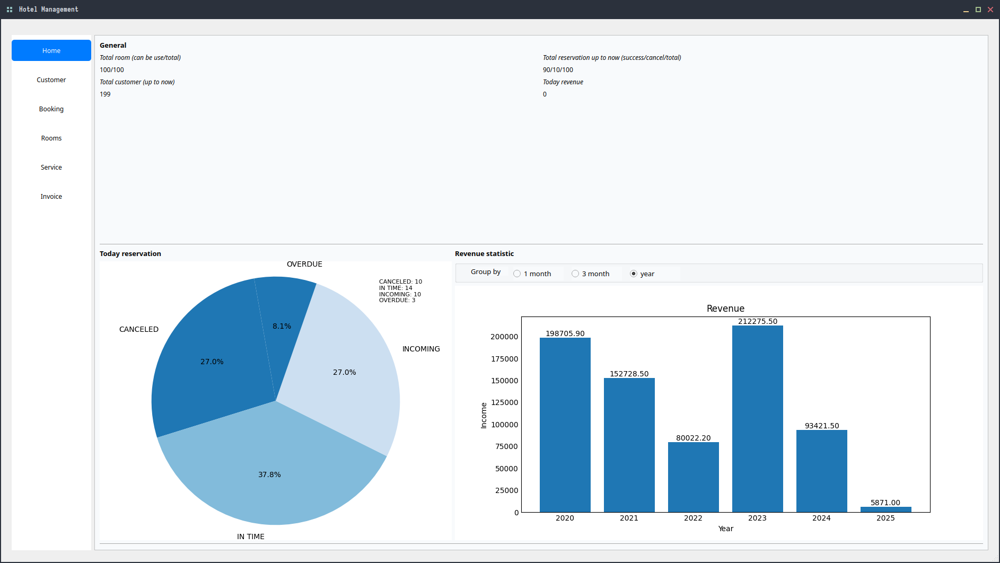
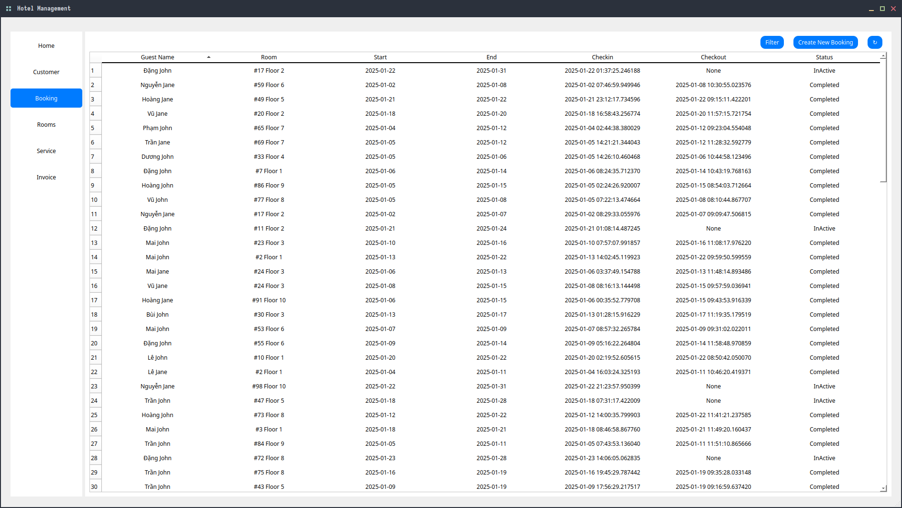
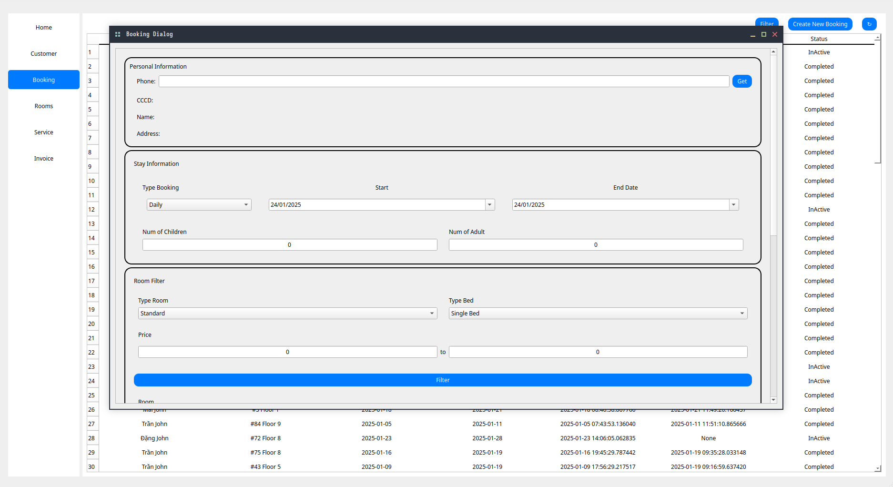
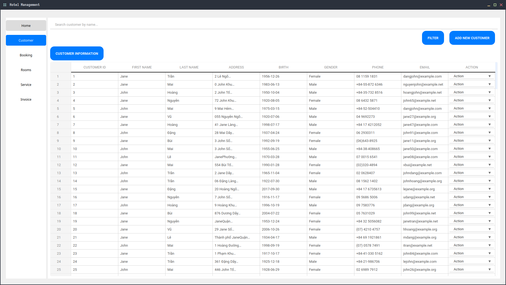
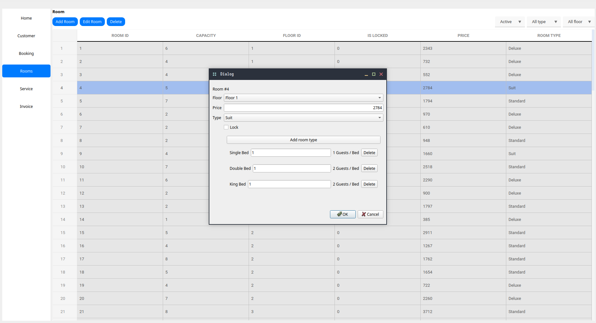
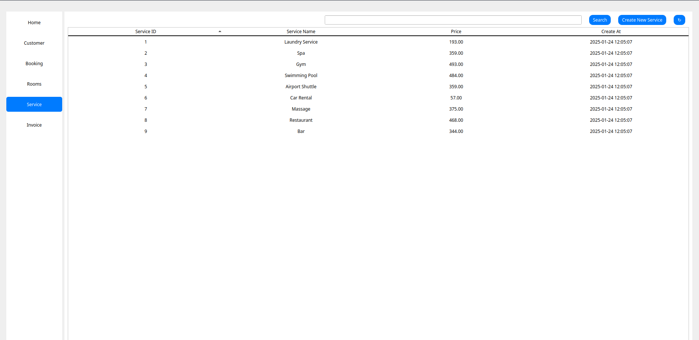
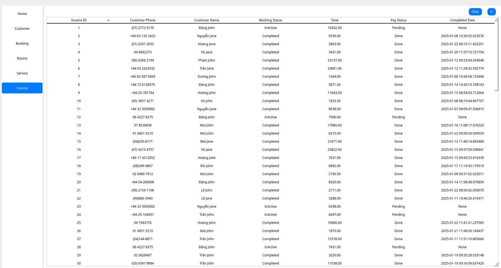

# Database design 
[Database diagram](/db/README.md)
# Setup 
1. Navigate to `src` 
2. Active env in linux environment 
```shell 
python3 -m venv env36 && source env36/bin/activate
```
3. Install dependencies
```
pip install -Ur requirements.txt
```


4. Start project with main entry 
```
python3 main.py
```
___ 

<details><summary><b>Snapshots</b></summary>

Statistic

Booking


Customer

Room 

Room service

Invoice history


</details>

